> 参考 [mixi-inc/iOSTraining 1.3 UIViewController1 UIViewController のカスタマイズ(xib, autoresizing)](https://github.com/mixi-inc/iOSTraining/wiki/1.3-UIViewController1---UIViewController-%E3%81%AE%E3%82%AB%E3%82%B9%E3%82%BF%E3%83%9E%E3%82%A4%E3%82%BA(xib,-autoresizing))

参考 : [UIViewController Class Reference](https://developer.apple.com/library/ios/documentation/UIKit/Reference/UIViewController_Class/index.html) | [ViewController プログラミングガイド](https://developer.apple.com/jp/devcenter/ios/library/documentation/ViewControllerPGforiOS.pdf)

# UIViewControllerの役割

役割は大きく分けて三つあります。

1. **コンテンツを表示させる**
2. 複数の UIViewController を管理するコンテナ
3. [**他のViewControllerと連携する Modal**(1.4.1)](./1-4-1_ModalViewController-xib.md)

本節では**1**、**3**の解説をします。(2に関しては次章)
そしてUIViewControllerのライフサイクルに関しても、[1.5 ライフサイクル](1-5_UIViewController-lifecycle.md)にて説明します。

# コンテンツを表示させる

ViewControllerを用いてコンテンツを表示するとき、もっともよく使われる方法はUIViewControllerを継承したクラスを作り、カスタマイズしていく方法です。
以下ではその方法について説明します。

UIViewControllerのデザインのカスタマイズ方法は、大きく分けて以下の2つの方法があります。

- xibを用いる
- storyboardを用いる

xibはInterface Builderを利用して、UIViewやUIViewControllerのパーツを画面単位でデザインするツールです。
storyboardは複数のViewController間の連携や画面遷移などをよりデザインしやすくしたツールです。
細かいパーツや再利用性の高いパーツを作る際はxibを用いるほうが利便性が高く、ViewController間の連携を考えるときはstoryboardの方が便利なケースがあります。
そのためどちらを使うかはケースバイケースだと認識すればよいでしょう。

このページではxibを用いた方法について解説します。storyboardの資料をご覧になりたい場合はこちらをご覧ください。
[1.3.2 UIViewControllerのカスタマイズ(storyboard)](./1-3-2_UIViewController-customization-storyboard.md)

## はじめに

Xcodeのプロジェクトを、プロジェクトテンプレートの`Single View App`から作成した場合

* AppDelegate.swift
* Main.storyboard
* ViewController.swift

などのファイルが初期状態で作成されます。
xibを利用する場合、`Main.storyboard`と`ViewController.swift`は利用しないため削除します。
また、プロジェクトのTargetのMain InterfaceがMainになっていますが、`Main.storyboard`を削除しているので空にします。

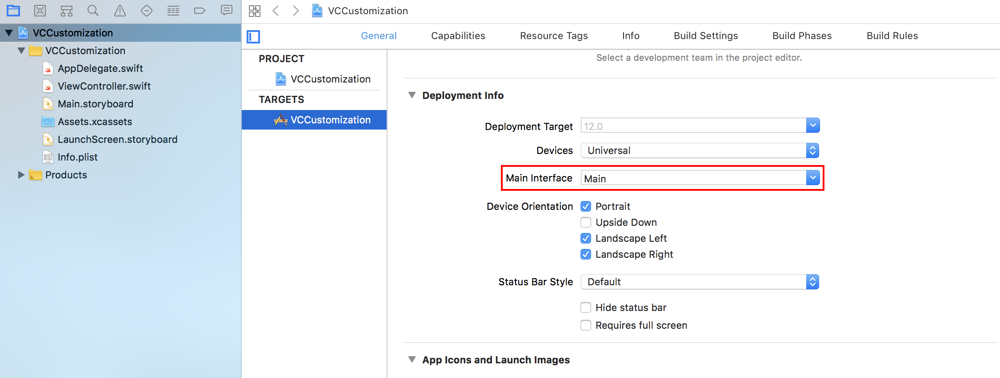

## 新しいUIViewControllerのサブクラスを作成

まず、新規クラスファイルを生成します。クラス名はここではSampleViewControllerとします。

1. `command + n`あるいはメニューの`File → New → File`と選んで新しいファイルを作成します
2. `Cocoa Touch Class`を選択します
3. Class **SampleViewController**, Subclass of **UIViewController**, Also create XIB Fileのチェックをします
4. `Next → Create` とすると新規ファイル`SampleViewController.swift`が作成されます

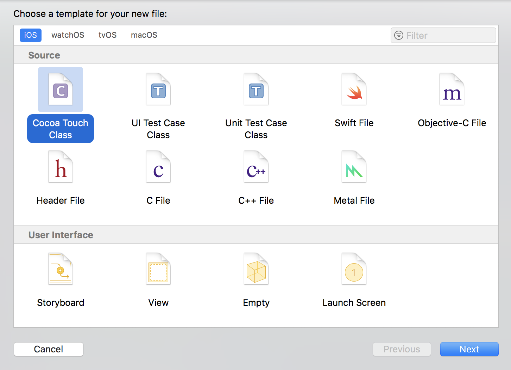
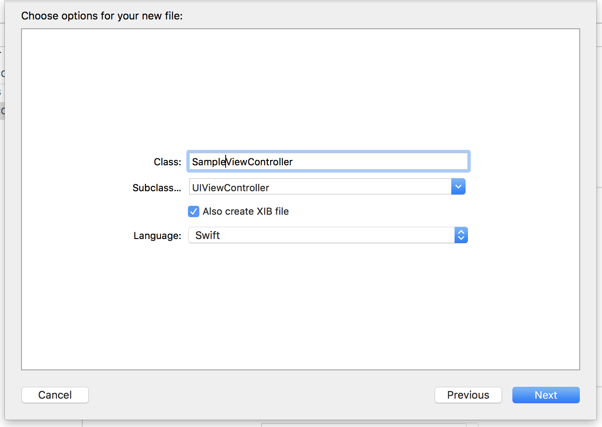

生成されたSampleViewControllerは、AppDelegateでUIWindowに紐づけ、画面に表示できる状態にします。

```swift
@UIApplicationMain
class AppDelegate: UIResponder, UIApplicationDelegate {

    var window: UIWindow?

    func application(_ application: UIApplication, didFinishLaunchingWithOptions launchOptions: [UIApplication.LaunchOptionsKey: Any]?) -> Bool {

        let window = UIWindow(frame: UIScreen.main.bounds)
        window.rootViewController = SampleViewController()
        window.makeKeyAndVisible()
        self.window = window

        return true
    }
}
```

### SampleViewControllerのカスタマイズ

SampleViewControllerの見た目をカスタマイズします。
ViewControllerには一つのUIViewインスタンスが割り当てられていて、そのUIViewをベースにカスタマイズしていきます。
UIViewについての詳しい説明は、[2日目 2. UIView](../day2/2-1_UIView.md)をご覧ください。

ここではオブジェクトライブラリから適当にViewのパーツを、SampleViewControllerのViewにドラッグ&ドロップしてください。
ドロップできないものもいくつかあり、それらはxibでは使えないパーツになります。何が使えて、なぜ使えないかは
UIKitに慣れてくると次第に理解が深まると思います。

また次の章では、ラベル(UILabel)とボタン(UIButton)を利用するため、一つずつ配置しておいてください。

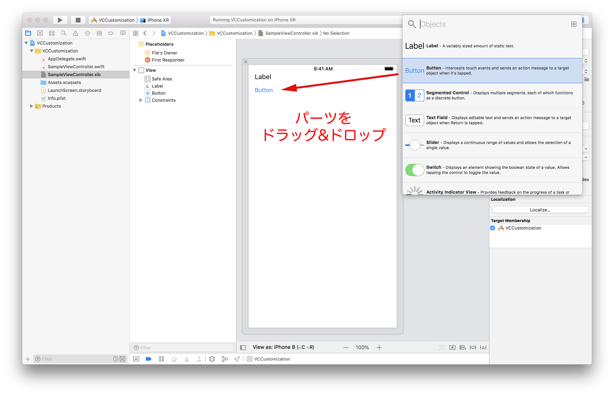

それぞれのパーツに配置できたら、AutoLayoutで制約をつけます。
AutoLayoutの詳しい説明に関しては、[2日目 2.4 AutoLayout](../day2/2-4_AutoLayout.md)をご覧ください。
下図のようにUILabelに

- Safe AreaのTopに対してUILabelのTopを0px
- ViewのLeadingに対してUILabelのLeadingを16px

の制約をつけます。
また、UIButtonに

- UILabelのBottomに対してUIButtonのTopを8px
- ViewのLeadingに対してUIButtonのLeadingを16px

の制約をつけます。

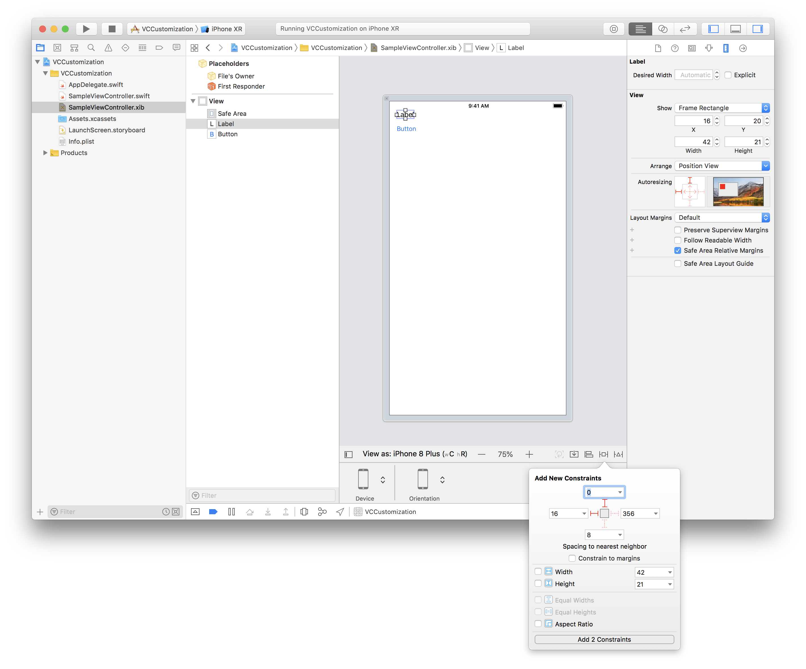

余談ですが、Safe AreaはiOS11から利用できるようになっています。
下図のように、iPhone X系のノッチを持つ端末と、iPhone 8系のノッチを持たない端末とでSafe Areaが異なります。
この領域内にUIパーツが収まるように配置しましょう。

| iPhone X系 | iPhone 8系 |
| :-: | :-: |
| 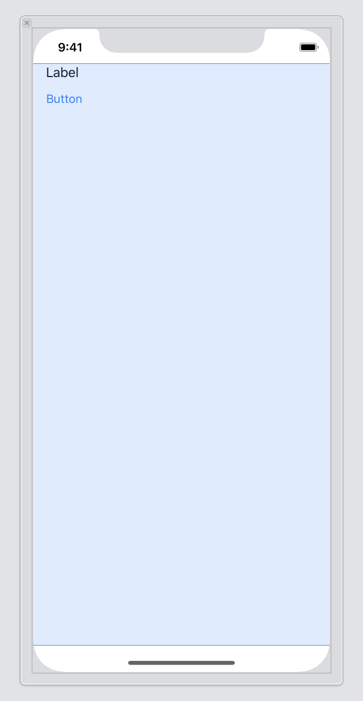 |  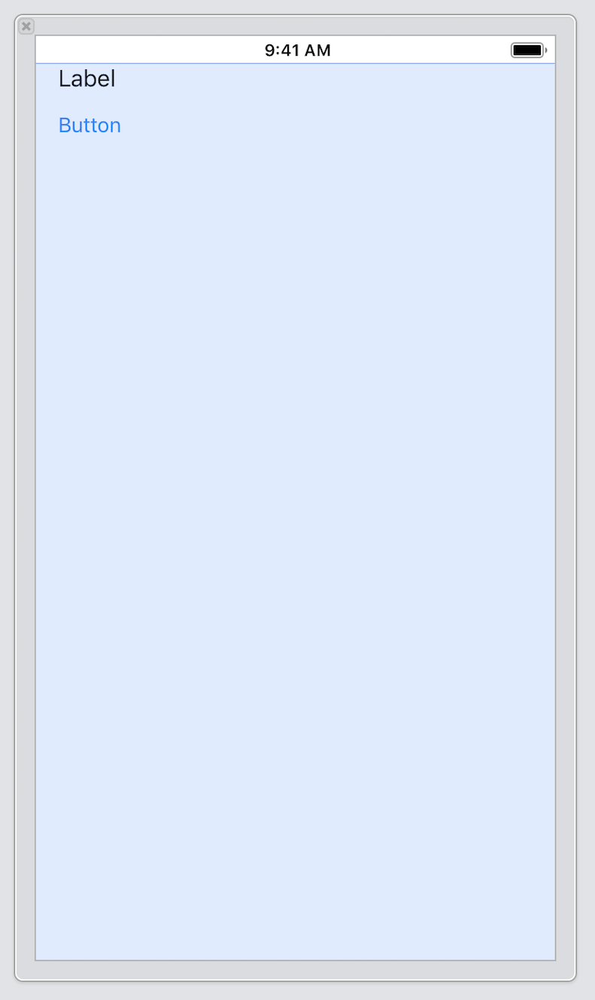 |

ここまでできたら、一度実行してみてください。シミュレータでカスタマイズしたViewControllerが表示されるはずです。

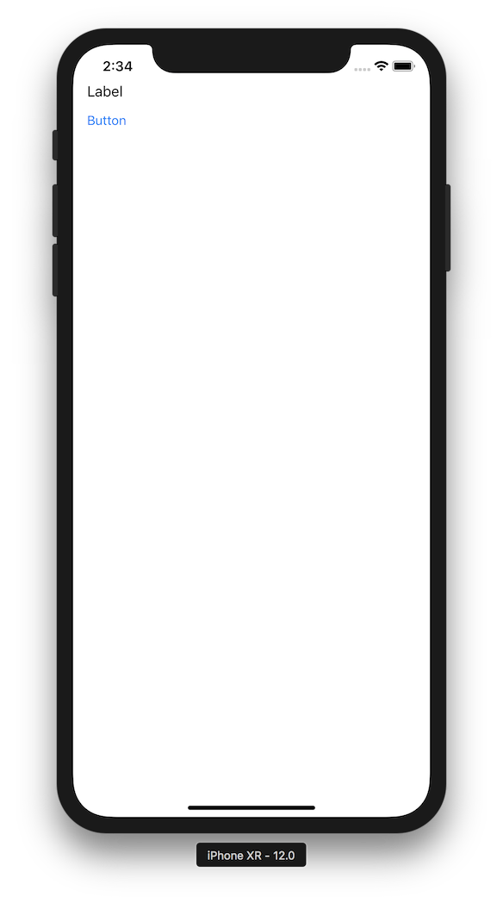

## 各パーツと実装を結びつける

storyboardやxib上のパーツとソースコードを紐づけます。
さらにView上のパーツを各クラスのプロパティと紐づけたり、ユーザーのアクションとView Controllerのメソッドを結びつけます。
(アウトレットという仕組みです)

### IBOutlet

各パーツとクラスのプロパティを結びつけるにはIBOutletを用います。手順としては、IBOutletのプロパティをコード上で作成し、そのプロパティをxib上のパーツと紐づけます。

##### SampleViewControllerにプロパティを追加

SampleViewControllerに`@IBOutlet`キーワードを付けた`UILabel`のプロパティを定義します。

```swift
class SampleViewController: UIViewController {

    @IBOutlet weak var label: UILabel!

    override func viewDidLoad() {
        super.viewDidLoad()

        // Do any additional setup after loading the view.
    }
}
```

##### xib上で紐づける

プロパティの定義ができれば再びxibに戻ってFile's Ownerを選択します。Connections InspectorをするとOutletsが表示されます。

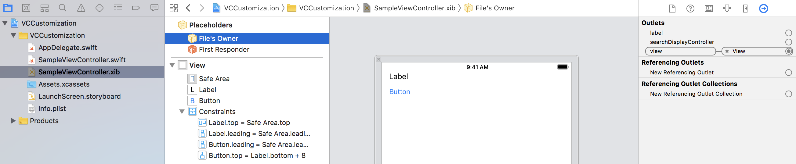

この中に先ほど作成した `label` という選択肢があると思います。
labelの右側の円内からドラッグしてViewController上のラベルにドロップしてください。
こうように、コード上のプロパティとxib上のUIとを紐付けることができます。

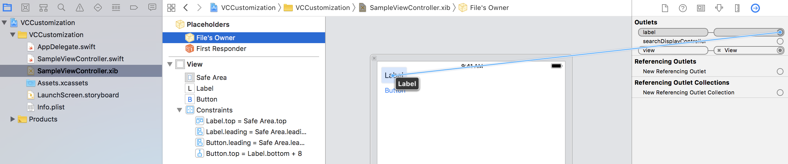


##### labelの中身を書き換える

実際に結びつけることができたら、ラベルの中身をコード上から書き換えて見ましょう。SampleViewControllerのviewDidLoadを次のように書き換えます。

```swift
override func viewDidLoad() {
    super.viewDidLoad()

    // Do any additional setup after loading the view.
    label.text = "Test"
}
```

labelプロパティが正しく紐付けできていれば、実行時にラベルの文字列が "Test" に変化します。
(長めのテキストを入れた場合は自動的にTruncateされます)

### IBAction

UI上のパーツに対してユーザーが何かアクションを起こした時に、対応するメソッドを呼び出すにはIBActionを利用します。
手順としてはIBOutletと同様に、メソッドを宣言、定義し、storyboard上のパーツと結びつけます。

##### メソッドの定義

SampleViewControllerに以下のメソッドを定義してください

```swift
@IBAction func buttonTapped(_ sender: UIButton) {
    label.text = "YES"
}
```

このメソッドに@IBActionが付属していますが、これはInterface Builderが紐付けれるメソッドを探すためのキーワードとなります。

##### メソッドとパーツアクションの結びつけ

メソッドの実装ができれば先ほどと同様な紐付けが行えます。

再びxibに戻ってSampleViewControllerを選択し、Document OutlineのSampleViewControllerを選択して右クリックをすると次のようなパネルが出現します。
つぎは今定義したメソッドが増えていると思うので、ボタンにドラッグ&ドロップします。

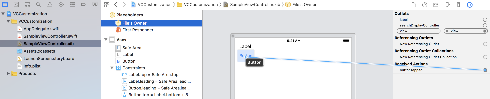

ドロップしたときに、どのアクションと対応するかの選択肢が表示されます。ボタンタップ時には `Touch Up Inside` を選ぶのがよいでしょう。

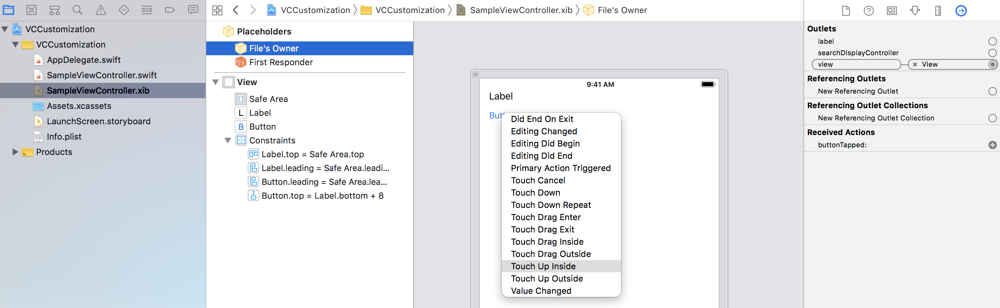

これで紐付けは完了です。実行してボタンをタップすることで、ラベルの文字が変わります。

### 演習課題
ここまでで、xibを用いてUIViewControllerをカスタマイズすることができるようになりました。
ここでレクチャーした内容を実際に実装するのが、演習課題となります。

解答例については[samples/day1/sample1-3-1/VCCustomization](../../samples/day1/sample1-3-1)を参照してください。

##### 課題1.
新規プロジェクトを作成してください。
そのあと新しいViewControllerのクラスを作成し、起動時に表示されるViewControllerとなるようにしてください。

##### 課題2.
課題1.で作成したViewControllerにUILabelとUIButtonのパーツを配置してください。
UIButtonをタップしたらラベルの文字列が `YES` となるようにしてください。

### おまけ
Assistant Editorを表示した上で、`control + ドラッグ&ドロップ`でプロパティの追加とIBOutletやIBActionの結びつけを一発でできます。

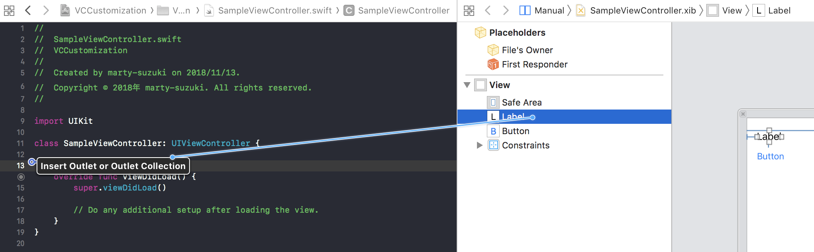
