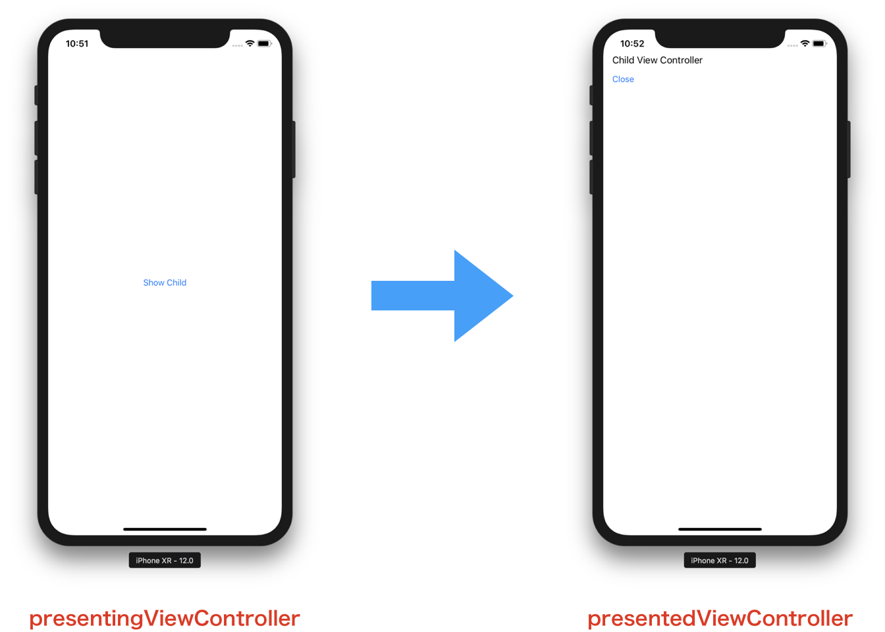

> 参考 [mixi-inc/iOSTraining 1.4 UIViewController2 ModalViewController](https://github.com/mixi-inc/iOSTraining/wiki/1.4-UIViewController2---ModalViewController)

参考 : [UIViewController Class Reference](http://developer.apple.com/library/ios/#documentation/uikit/reference/UIViewController_Class/Reference/Reference.html) | [View Controller Programming Guide for iOS](http://developer.apple.com/library/ios/featuredarticles/ViewControllerPGforiPhoneOS/ViewControllerPGforiOS.pdf)

# 概要

UIViewControllerには他のViewControllerと連携して新しいViewControllerを表示するなどの役割もあります。
連携のやり方には代表的なものに Modal, Navigation Controller, TabBarController などの方法があり、この章ではModalを用いた方法を解説します。

Modal View Controllerは「現在のViewControllerで行っている操作を一時中断して新しいViewControllerを表示する」というケースで利用されます。公式ドキュメントには以下のようなケースで使うことを想定しています。

- ユーザから直ちに情報を収集するため
- 何らかのコンテンツを一時的に表示するため
- 作業モードを一時的に変更するため
- デバイスの向きに応じて代替のインターフェイスを実装するため
- 特殊なアニメーショントランジションを使用する(またはトランジションなしの)新しいビュー 階層を表示するため

UIViewController は一つの ModalView を表示することが可能で、そのときに、Modal を表示する ViewController と ModalViewController には親子関係ができます。

> 
>
> [View Controller Programming Guide for iOS](https://developer.apple.com/library/content/featuredarticles/ViewControllerPGforiPhoneOS/PresentingaViewController.html) から引用

また、Modal View Controller の上に Modal View Controller をだすこともできます。

>   
> [View Controller Programming Guide for iOS](https://developer.apple.com/library/content/featuredarticles/ViewControllerPGforiPhoneOS/TheViewControllerHierarchy.html#//apple_ref/doc/uid/TP40007457-CH33-SW1) から引用

## 表示方法

Modal View Controllerの表示は、任意のViewControllerをインスタンス化し、親となるViewControllerの`func present(_:animated:completion:)`にViewControllerのインスタンスを渡すことで表示されます。

```swift
let child = ChildViewController()
present(child, animated: true, completion: nil)
```

### 表示オプション

Modal View Controllerで表示する際、以下のプロパティを変更することで遷移方法や表示形式を変更できます。

- modalTransitionStyle... 画面遷移方法の変更

```swift
enum UIModalTransitionStyle: Int {
    case coverVertical
    case flipHorizontal
    case crossDissolve
    case partialCurl
}
```

- modalPresentationStyle... 表示形式の変更

```swift
enum UIModalPresentationStyle: Int {
    case fullScreen
    case pageSheet
    case formSheet
    case currentContext
    case custom
    case overFullScreen
    case overCurrentContext
    case popover
    case none
}
```

## Modal View Controllerを閉じる

Modal View Controllerを表示できたら、次はModalViewControllerを閉じる方法について解説します。

まずは表示しているChildViewController上にボタンとボタンタップ時に呼ばれるメソッドを定義します。
サンプルコードではメソッド名を `func close(_:)` としています。
ボタンがタップされた時 `func close(_:)` が呼ばれます。このメソッドが呼ばれた時に画面を閉じるコードを書いていきます。

### Modal View Controllerを閉じるメソッドとその責務

表示したModal View Controllerを閉じるにはUIViewControllerのインスタンスメソッド [`dismiss(animated:completion:)`](https://developer.apple.com/reference/uikit/uiviewcontroller/1621505-dismiss) を用います。

Modal View Controllerを表示する際、表示するViewControllerと表示されるViewControllerの関係が存在します。
今回のケースでは ParentViewControllerが表示する側、ChildViewControllerが表示される側となります。
またプロパティとして、表示している側は `presentingViewController`、表示されている側は `presentedViewController`となります。

そして、**表示している** 側のViewControllerに対して、表示したViewControllerを閉じる責務が発生します。
あるクラスのインスタンスを生成したら、生成したクラスが責任を持って処理を行う、という原則に則っています。



### Delegateパターン

ChildViewControllerのボタンがタップされた時に、どうすればParentViewControllerが閉じるアクションを行えるのでしょうか。
ParentViewControllerに対してChildViewControllerのボタンがタップされた、あるいは作業が完了したことを通知する必要があります。
そのような場合に、Delegateパターン（以下Delegate）が利用できます。
Delegate とはあるクラスで処理できない処理を他のクラスに代わりに処理させるパターンです。

#### Delegateを使わない実装

一番簡単な方法は、ChildViewControllerがプロパティとしてParentViewControllerのインスタンスを持ち、ボタンがタップされた時にそのインスタンスメソッドを呼ぶ方法です。

```swift
class ChildViewController: UIViewController {
    // ChildViewControllerがParentViewControllerのプロパティを持つ
    weak var parent: ParentViewController?

    override func viewDidLoad() {
        super.viewDidLoad()

        // Do any additional setup after loading the view.
    }
}    
```

```swift
let child = ChildViewController()
// ChildViewControllerのparentプロパティにselfをセット
child.parent = self
present(child, animated: true, completion: nil)
```

```swift
// ChildViewControllerのタップハンドラ
@IBAction func close(_ button: UIButton) {
    // parentのメソッドを呼ぶ
    parent?.dismiss(animated: true, completion: nil)
}
```

この方法で、ViewControllerを閉じることができますが、

* ChildViewController内で直接ParentViewControllerのメソッドを呼び出しているので、自分でモーダルを閉じている
* ChildViewControllerがParentViewControllerに依存している

という問題点があります。

#### SwiftにおけるDelegateパターン

上記の問題点を、Delegateパターンを用いて解決します。
Delegateパターンを端的に言うと、メソッドのインタフェースだけ宣言しておき、あるクラスはそのメソッドを実装します。このメソッドを利用する側は、そのクラスについて知る必要はなく、インタフェースに従うのみとすることでクラス間の依存を取り除くデザインパターンです。

今回のモーダルを閉じるケースをサンプルにDelegateパターンを実装します。
Delegateパターンを用いる際、Swiftでは **プロトコル** という仕組みを利用します。
このプロトコルのメソッドを実装することを **プロトコルに準拠する** と呼ぶことが多いのです。
メソッドを実装してプロトコルに準拠します。

```swift
// childViewController.swift
protocol ChildViewControllerDelegate: AnyObject {
    func childViewControllerDidTapClose(_ viewController: ChildViewController)
}
```

このケースでは、 `ChildViewControllerDelegate` がプロトコル名で `func childViewControllerDidTapClose(_:)` がこのプロトコルに準拠したクラスが実装するメソッドになります。

次に、プロトコル `ChildViewControllerDelegate` をParentViewControllerに準拠させます。
クラスの宣言の際に `class クラス名 : スーパークラス名, 準拠するプロトコル名 {` または `extension クラス名 : 準拠するプロトコル名 {` とすることで、このクラスはこのプロトコルに準拠しています、という宣言になります。

```swift
class ParentViewController: UIViewController, ChildViewControllerDelegate {
// 中略
}
```

次に、実装側でプロトコルのメソッドを実装します。

```swift
class ParentViewController: UIViewController, ChildViewControllerDelegate {
    // 中略
    func childViewControllerDidTapClose(_ viewController: ChildViewController) {
        // 後で実装します。
    }
    // 中略
}
```

このように実装することでプロトコルを採用したDelegateパターンを使うことができます。

#### 実際にDelegateパターンを利用する

さて、実際にこのパターンを用いてモーダルを閉じます。
まず、ChildViewControllerにプロパティを一つ追加します。

```swift
class ChildViewController: UIViewController {

    weak var delegate: ChildViewControllerDelegate?
    // 中略
}
```

ポイントとしては

* プロパティのタイプが `weak` になっている点。これは循環参照を避けるためにあります。
* `ChildViewControllerDelegate` という型。ChildViewControllerDelegateに準拠していたらどんなクラスでもOKということです。


次にChildViewControllerのボタンタップハンドラを次のように修正します。

```swift
@IBAction func close(_ button: UIButton) {
    delegate?.childViewControllerDidTapClose(self)
}
```

ChildViewControllerのdelegateプロパティのメソッドである `func childViewControllerDidTapClose(_:)` を呼び出しています。
delegateプロパティはどんなクラスかは分かりませんが、ChildViewControllerDelegateに準拠しているので、このメソッドがあるはずなので呼び出すことができます。

次はParentViewControllerを修正します。ChildViewControllerを表示するときのメソッド `func showChild(_:)` と `func childViewControllerDidTapClose(_:)` を合わせて以下のように実装します。

```swift
@IBAction func showChild(_ sender: UIButton) {
    let child = ChildViewController()
    child.delegate = self // delegateをParentViewController自体に指定
    present(child, animated: true, completion: nil)
}

func childViewControllerDidTapClose(_ viewController: ChildViewController) {
    dismiss(animated: true, completion: nil)
}
```

これで正しくモーダルを閉じることができるようになります。表示してからモーダルを閉じるまでの一連の流れを見てみましょう。

1. ParentViewControllerのshowChildが呼ばれる
* ChildViewControllerインスタンスを生成し、delegateプロパティに self (ParentViewControllerインスタンス) を代入する
* `func present(_:animated:completion:)` でChildViewControllerを表示する
* ChildViewControllerのボタンをタップすると、タップハンドラ (`func close(_:)`) が呼ばれる
* ChildViewControllerの `self.delegate` すなわち 2.でセットした ParentViewControllerインスタンス のメソッド `func childViewControllerDidTapClose(_:)` が呼ばれる
* ParentViewControllerのhildViewControllerDidTapCloseで `func dismiss(animated:completion:)` を呼ぶことでモーダルが閉じる

以上を実装することで、正しくモーダルが閉じます。

### 注意事項

Modal View Controllerの表示、非表示アニメーションが同時に起きるとアニメーションの衝突でクラッシュするので気をつけてください。

## 演習課題

ここまでにModal View Controllerを出現、閉じるという一連の画面遷移について学びました。この章での演習課題は、
この一連の画面遷移を再現することになります。

### 演習1.

ParentViewControllerとChildViewControllerをUIViewControllerのサブクラスとして追加してください。
次に、ParentViewControllerにボタンを配置し、タップしたときにChildViewControllerがモーダルで表示されるように実装してください。

### 演習2.

ChildViewControllerにボタンを追加し、ボタンをタップしたらChildViewControllerが閉じるようにしてください。
ただしChildViewController自身が閉じるのではなくdelegateを使うようにしてください。

### 回答

回答については [samples/day1/sample1-4-1/VCCustomization](../../samples/day1/sample1-4-1) をごらんください。
