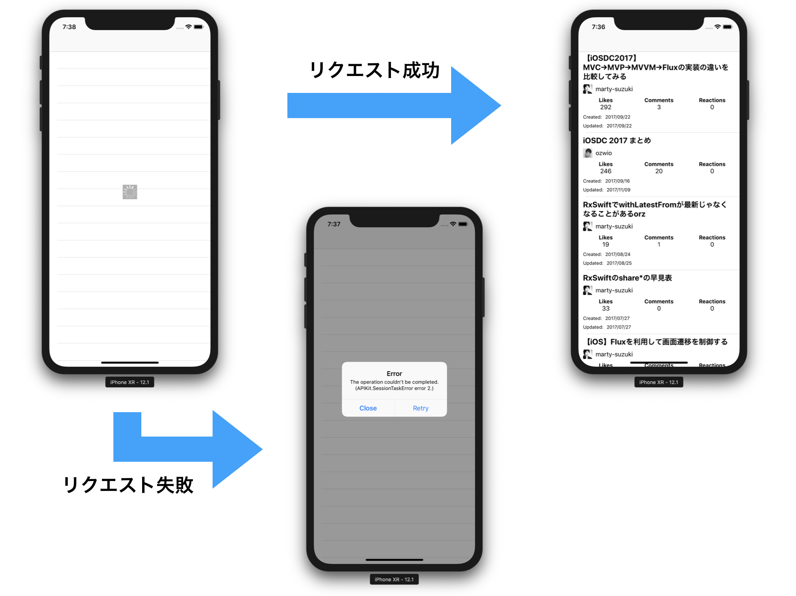

> 参考 [mixi-inc/iOSTraining 9.3 クラス設計演習](https://github.com/mixi-inc/iOSTraining/wiki/9.3-%E3%82%AF%E3%83%A9%E3%82%B9%E8%A8%AD%E8%A8%88%E6%BC%94%E7%BF%92)

**問題**

リモートから情報を取得し、その情報をもとに tableView を構成してください。

なお、実装の際には以下の点を考慮してください。

- データ URL -> [https://qiita.com/api/v2/items?query=Swift](https://qiita.com/api/v2/items?query=Swift)
- 通信を行っていることをユーザに明示しましょう。
- 通信が失敗した場合のエラーハンドリングとユーザへのフィードバックを行いましょう。

Cellに表示する要素は

- 投稿タイトル //"title"
- ユーザーアイコン //"user" -> "profile_image_url"
- ユーザーID //"user" -> "id"
- いいね数 //"likes_count"
- コメント数 //"comments_count"
- リアクション数 //"reactions_count"
- 作成日（余裕があれば） //"created_at"
- 更新日（余裕があれば） //"updated_at"

APKit、Kingfisherなどを使っても良いです。
